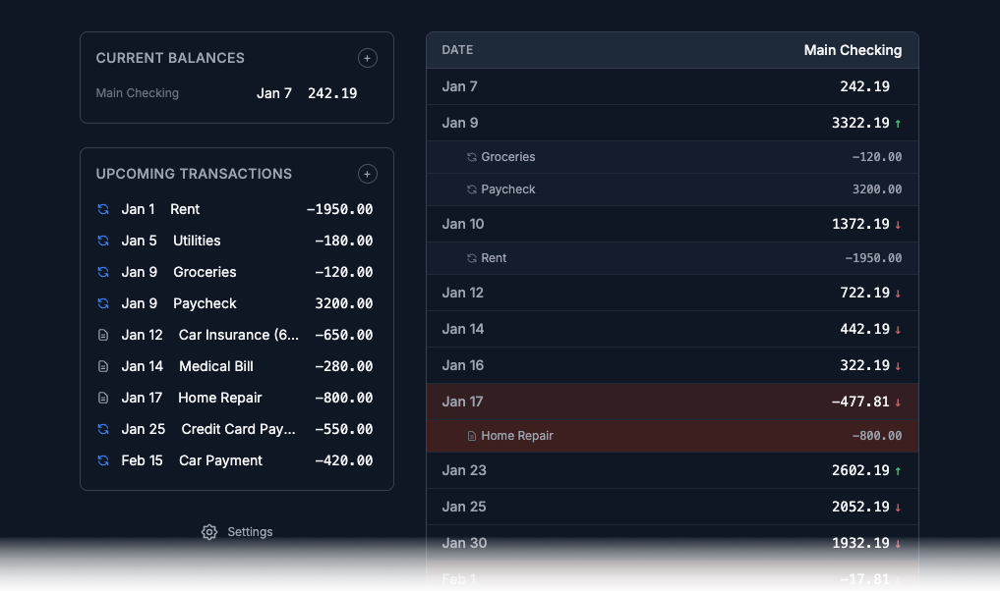

# CashFlow

**Live at: [https://cashflow.brasslogic.money](https://cashflow.brasslogic.money)**

CashFlow is a personal finance projection tool that helps you see into the future of your bank accounts. Never run out of money again by projecting your account balances weeks or months ahead based on expected transactions.



## What It Does

CashFlow allows you to:
- **Project future balances**: See your account balances weeks or months ahead based on expected transactions
- **Set up recurring transactions**: Define recurring income and expenses once, and they'll automatically appear in your projections
- **Get early warnings**: Be alerted when balances might go negative, so you can plan ahead
- **Track multiple accounts**: Manage all your accounts in one place

Simply add your accounts, set up your recurring transactions (paychecks, rent, bills, etc.), and CashFlow will show you a projection of your balances over time. The app highlights potential shortfalls in orange, giving you advance notice to adjust your spending or income.

## Quick Start

1. Run `./init.sh` to install dependencies and start the development server
   - This will automatically set up SQLite for local development
   - The database will be seeded with sample data
2. Open [http://localhost:3000](http://localhost:3000) in your browser

**Note**: For local development, no database configuration is needed - SQLite is used automatically. For production deployment, see the [PostgreSQL Deployment Guide](./docs/postgresql-deployment-guide.md).

### Sample Data

The app comes pre-loaded with minimal sample data to demonstrate core features:
- **1 tracked account**: Main Checking ($3,500)
- **2 external accounts**: Income, Expenses
- **3 recurring transactions**:
  - Paycheck: $2,800 every 2 weeks
  - Rent: $1,800 monthly on the 1st
  - Credit Card Payment: $450 monthly on the 25th
- **Projections**: Shows balance trends over time based on recurring transactions

To reseed the database at any time, run:
```bash
npm run db:seed
```

## Architecture

### Stack
- **Frontend**: Next.js 14 (App Router) + React + TypeScript + Tailwind CSS
- **Backend**: Next.js API Routes
- **Database**: SQLite (local dev/tests) + PostgreSQL (production) via Prisma ORM
- **Auth**: NextAuth.js with PrismaAdapter (Google and Apple Sign-In configured)
- **Deployment**: Vercel-ready with PostgreSQL

### Key Design Decisions

1. **Data Adapter Pattern**: All data access goes through the `DataAdapter` interface, making it easy to swap storage backends (see `src/lib/data-adapter.ts`)

2. **Double-Entry Model**: Every transaction has a source and destination account, enabling accurate tracking and future reporting capabilities

3. **API-First**: All functionality exposed via REST API, making it easy to add mobile clients or third-party integrations

4. **Projection Engine**: Materializes recurring transactions and calculates daily balances for future account projections

## Project Structure

```
├── docs/
│   ├── specification.md           # Project requirements
│   ├── feature_list.json          # All features to implement
│   ├── implementation-progress.txt # Development log
│   ├── coder-instructions.md       # Guidelines for coding sessions
│   ├── initializer-instructions.md # Setup guidelines
│   ├── postgresql-deployment-guide.md # Production deployment guide
│   └── google-oauth-setup.md       # OAuth configuration guide
├── prisma/
│   ├── schema.prisma              # Active schema (auto-switched based on DATABASE_URL)
│   ├── schema.sqlite.prisma       # SQLite schema (for local dev and tests)
│   └── schema.postgres.prisma     # PostgreSQL schema (for production)
├── scripts/
│   ├── switch-schema.js            # Automatic schema switching script
│   └── seed-user.js                # User seeding utility
├── src/
│   ├── app/
│   │   ├── api/                    # API routes
│   │   │   ├── accounts/
│   │   │   ├── transactions/
│   │   │   └── projections/
│   │   ├── layout.tsx              # Root layout
│   │   └── page.tsx                # Home page
│   └── lib/
│       ├── db.ts                   # Prisma client
│       ├── data-adapter.ts         # Data adapter interface
│       └── prisma-adapter.ts       # Prisma implementation
└── init.sh                         # Setup script
```

## Development Workflow

1. Run `./init.sh` to start the development environment
2. Check `docs/feature_list.json` for the next feature to implement
3. Test features end-to-end before marking them complete
4. Update `docs/implementation-progress.txt` with progress and decisions
5. Commit completed features with clear messages

## Testing

Run tests with:
```bash
npm test          # Run all unit tests
npm test:watch    # Run tests in watch mode
npm test:e2e      # Run end-to-end tests (Playwright)
npm test:e2e:ui   # Run E2E tests with UI mode
```

**Important:** Tests use temporary SQLite database files to ensure complete isolation from development data. Test data is ephemeral and never persists to disk, preventing pollution of your seeded sample data or manual test data.

**Database Configuration:**
- **Local Development**: Uses SQLite (`file:./dev.db`) - no setup required
- **Tests**: Uses temporary SQLite files - automatically configured
- **Production**: Uses PostgreSQL - schema automatically switches based on `DATABASE_URL` format

## Features

See `docs/feature_list.json` for the complete feature list and implementation status.

For detailed project requirements, see `docs/specification.md`.

## API Endpoints

### Accounts
- `GET /api/accounts` - List accounts (filter by type: tracked/external)
- `POST /api/accounts` - Create account
- `GET /api/accounts/:id` - Get account
- `PUT /api/accounts/:id` - Update account
- `DELETE /api/accounts/:id` - Delete account

### Transactions
- `GET /api/transactions` - List transactions (filter by account, date range, recurring)
- `POST /api/transactions` - Create transaction
- `GET /api/transactions/:id` - Get transaction
- `PUT /api/transactions/:id` - Update transaction
- `DELETE /api/transactions/:id` - Delete transaction
- `GET /api/transactions/bulk` - Export all transactions as TSV
- `POST /api/transactions/bulk` - Import transactions from TSV

#### Bulk Transactions Format

The bulk transactions API uses Tab-Separated Values (TSV) format for backup and restore operations.

**TSV Format:**
```
ID	Type	Account ID	Amount	Date	Description	Frequency	Interval	Day of Week	Day of Month	End Date	Occurrences
```

**Columns:**
- **ID**: Transaction ID (optional; if present, updates existing transaction; if empty, creates new transaction)
- **Type**: `one-time` or `recurring`
- **Account ID**: Account ID (must exist in the database)
- **Amount**: Number (positive or negative)
- **Date**: YYYY-MM-DD (start date for recurring transactions)
- **Description**: Optional text
- **Frequency**: `daily`, `weekly`, `monthly`, or `yearly` (only for recurring)
- **Interval**: Number (only for recurring, defaults to 1)
- **Day of Week**: 1-7 (only for weekly, optional)
- **Day of Month**: 1-31 (only for monthly, optional)
- **End Date**: YYYY-MM-DD (optional, only for recurring, use `-1` for no limit)
- **Occurrences**: Number (optional, only for recurring, use `-1` for no limit)

**Example:**
```
ID	Type	Account ID	Amount	Date	Description	Frequency	Interval	Day of Week	Day of Month	End Date	Occurrences
	one-time	acc-123	-50.00	2025-01-15	Groceries	0					
tx-456	recurring	acc-789	2800.00	2025-01-20	Paycheck		weekly	2			-1	-1
	recurring	acc-123	-1800.00	2025-02-01	Rent		monthly	1		1	2025-12-31	
```

**Usage:**
- **Export**: `GET /api/transactions/bulk` returns a TSV file with all transactions (includes transaction IDs and account IDs)
- **Import**: `POST /api/transactions/bulk` with TSV data in the request body:
  - If a transaction has an ID, it updates the existing transaction
  - If a transaction has no ID (empty field), it creates a new transaction
  - Import validates all data and returns errors for any invalid rows before processing any transactions

### Projections
- `GET /api/projections` - Get projected balances (query: accountId, startDate, endDate)

## Deployment

For production deployment, see the [PostgreSQL Deployment Guide](./docs/postgresql-deployment-guide.md).

The application uses automatic schema switching:
- **Local Development**: SQLite (no configuration needed)
- **Production**: PostgreSQL (set `DATABASE_URL` in Vercel)

## License

MIT
